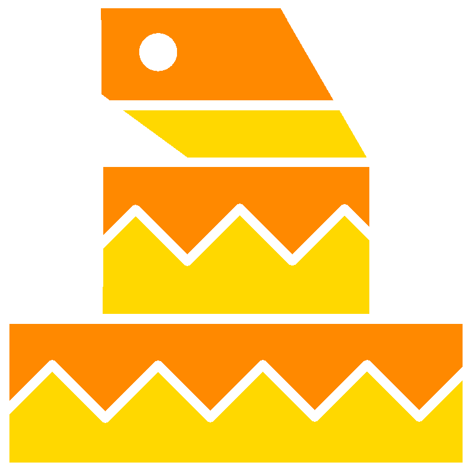

<h1 align="center">
	 
	Garter, by JohnAlex.CO
</h1>

## Language Description

Garter is planned to be a vaguely "Pythonic" language in look and feel, and is heavily inspired by BASIC, Netwide Assembler, and C89/C99.
It compiles to x86 Assembly _(additional targets only planned in the future)_ and will include support for macros, object-based programming, direct access to syscalls, and is built on what I believe to be the minimum amount of abstraction necessary to still allow it to be free of unnecessary boiler-plating and remain very easy to read.  

For comparisons between Garter (as its planned) and other popular programming languages, see [Language Comparisons](./info/comparisons.md)

## HIATUS UPDATE #3:

Most of the language's implementation documentation is complete, so I'll be uploading that relatively soon. I'm going to be recording and uploading devlogs on [YouTube](https://youtube.com/@garterlang) explaining the self-hosting process and implementation details of the language, building the standard library, and on installing and using Garter. 

## HIATUS UPDATE #2: 

This project is on a temporary hiatus because of paid work that's on my plate, and complications with moving and my personal life. The project will be open-sourced after release, and development is planned to resume around the newyear or a little after. I'm going to be updating this repo with implementation plans before I actually release the first version, and it will likewise launch here. Some planned features or implementation details have also been modified to make building the first version of the language possible sooner.

## Implemention 

First, a compiler for a subset of Garter is going to be written in x86 Assembly. Then the first Garter interpreter/compiler for the language itself will be written in that subset of Garter; this version will be `0.0.0`, and will not include a standard library. After that, I plan on writing a standard library, porting over some C and Assembly libraries, and creating a package manager (akin to `pip`) to fully flesh out the language. The plan is to essentially define every construct of the Garter language as x86 Instructions or macros of x86 instructions and then hand-translate the language standard into a functional piece of software. 

## Project Management

`Pre-0.0.0`, the project is going to remain private and I will be the only person working on the language. After `0.0.0` is released, I am going to open-source the software, but personally manage it. By the time `1.0.0` comes to fruition, I aim to have moved the project to being community-maintained, but will actively work on it. 

## Planned Features 

I plan on uploading the language specification as soon as possible, but the documentation is presently incomplete.
Briefly, though, the language:
- is semantically whitespaced, like Python, but does not care about whether you use tabs or spaces interchangably
- includes the following basic data-types: integers, floats, strings, _linked arrays_, and dictionaries.
- supports pointers and pointer arithmetic without including a separate explicit type
- interprets `*macro` blocks and retreives their return value to inline during compilation
- includes a small standard library with functions for manipulating strings, objects, rendering markdown and HTML,
system interrupts
- only includes what is needed during compilation, allowing extremely small binaries for `"Hello World"` and similar programs
- standard library allows linking with Assembly or C

The compiler will also have documentation for the language standard and the standard library included. I would like to **EVENTUALLY** make a language server for the language to make development with IDEs easier, but that is not a short-term goal
